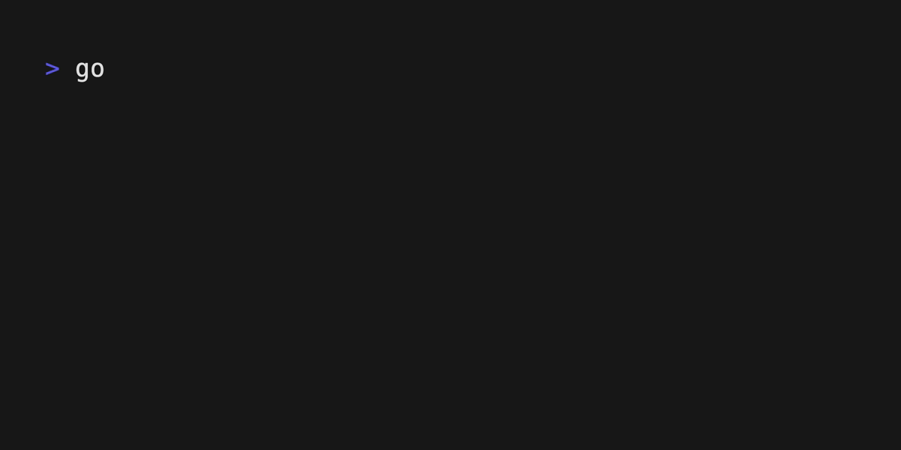
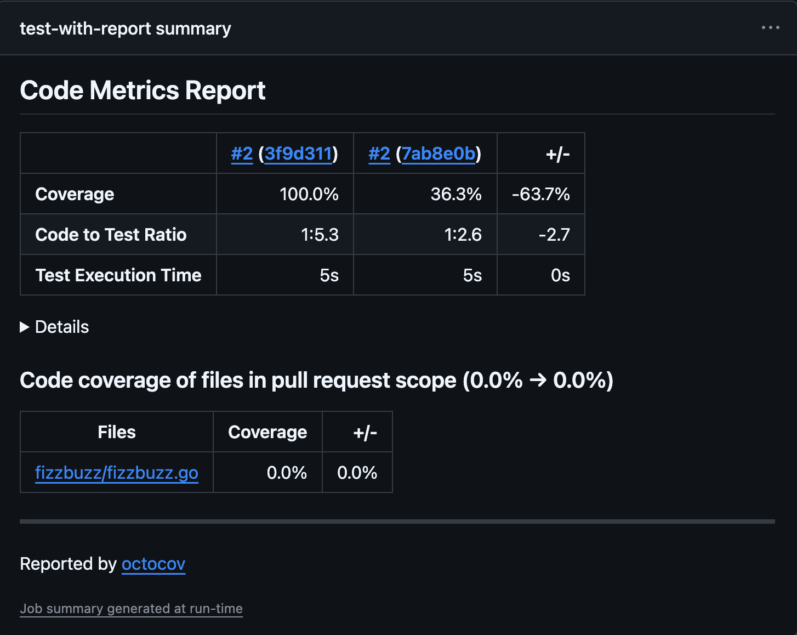
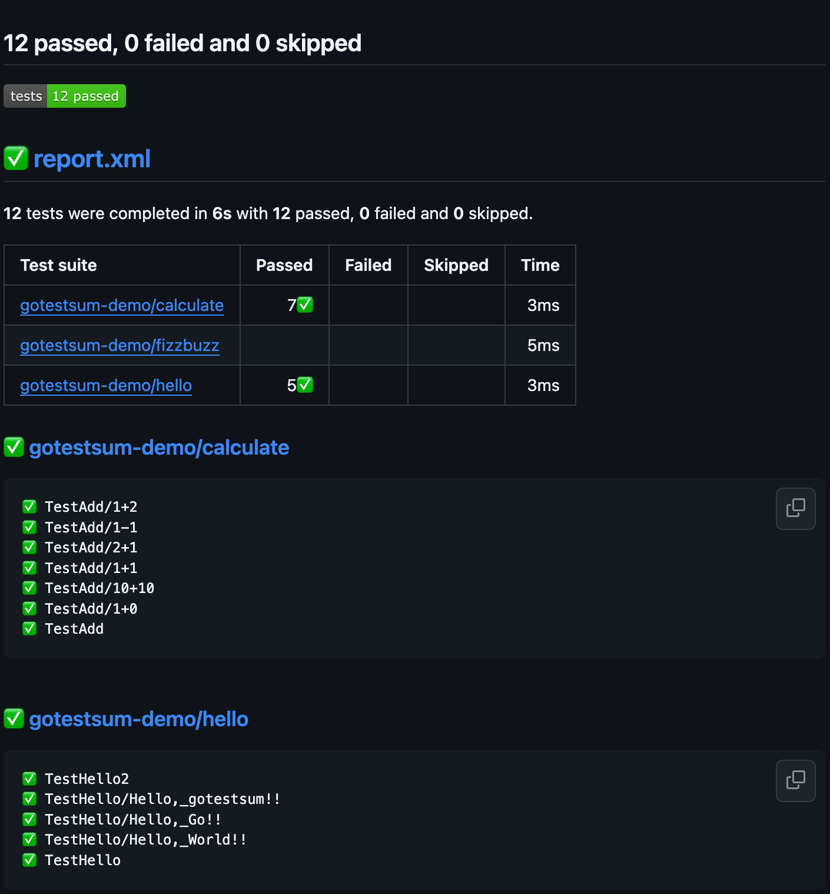

# gotestsum-dmeo

  

[gotestsum](https://github.com/gotestyourself/gotestsum?tab=readme-ov-file)のデモ。

## install

```
go install gotest.tools/gotestsum@latest

gotestsum --version
> gotestsum version dev
```

## test

```
% gotestsum --format testdox         
gotestsum-demo/calculate:
 ✓ Add (0.00s)
 ✓ Add 1+1 (0.00s)
 ✓ Add 1+2 (0.00s)
 ✓ Add 1-1 (0.00s)
 ✓ Add 2+1 (0.00s)

gotestsum-demo/hello:
 ✓ Hello (0.00s)
 ✓ Hello 2 (0.00s)
 ✓ Hello hello, go!! (0.00s)
 ✓ Hello hello, gotestsum!! (0.00s)
 ✓ Hello hello, world!! (0.00s)
```

### alias

```
alias gotest="gotestsum --format testdox"
alias gotestv="gotestsum --format standard-verbose"
```

```
% gotest -- -count=1 ./...
gotestsum-demo/calculate:
 ✓ Add (0.00s)
 ✓ Add 1+1 (0.00s)
 ✓ Add 1+2 (0.00s)
 ✓ Add 1-1 (0.00s)
 ✓ Add 2+1 (0.00s)

gotestsum-demo/hello:
 ✓ Hello (0.00s)
 ✓ Hello 2 (0.00s)
 ✓ Hello hello, go!! (0.00s)
 ✓ Hello hello, gotestsum!! (0.00s)
 ✓ Hello hello, world!! (0.00s)
```

## output

```
% gotestsum --jsonfile test-output.log
```

## notify

Macの場合は[terminal-notifier](https://github.com/julienXX/terminal-notifier)をインストールする

```
brew install terminal-notifier
```

通知のexampleコマンドをインストールする。

```
go install gotest.tools/gotestsum/contrib/notify
```

以下のテストを実行すると完了後に通知が飛ぶ。

```
% gotestsum --post-run-command notify 
```

## coverage

[octocov](https://github.com/k1LoW/octocov)を使用してPRのコメントにカバレッジを記載する。カバレッジレポートは以下のようにしてgotestsumを使用しても出力できる。

```
gotestsum --junitfile report.xml --format testdox --  -cover -coverprofile=coverage.out ./...
```

## CI

```yaml
      - name: Run tests and generate JUnit report, test coverage
        run: "${{ env.GOTESTSUM_BIN }}/gotestsum --junitfile report.xml --format testdox --  -cover -coverprofile=coverage.out ./..."

      - name: Upload test report and coverage
        uses: actions/upload-artifact@v4
        with:
          name: junit-test-report-and-coverage
          path: |
            report.xml
            coverage.out

      - name: Test Report Summary
        if: success() || failure()
        uses: dorny/test-reporter@v1
        with:
          name: Tests
          path: "*.xml"
          reporter: java-junit

      - uses: k1LoW/octocov-action@v1

```

## Sample



### Coverage



### Report

